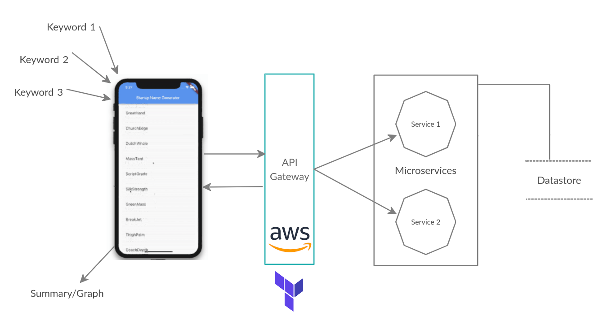

# null KRIYA: 25 JULY, 2020

## Objective

1. Build a [Flutter](https://flutter.dev/) app that consumes a [microservice](https://microservices.io/)
2. Manage the microservice using [Terraform](https://www.terraform.io/intro/index.html)
3. Collaborate with fellow hackers and get things done
4. Have fun!

## Problem Statement

1. As a mobile app developer, develop a simple **Flutter** app that accepts a user input and displays a summary of keywords used by various users, so that users can suggest what technologies do they find interesting.
2. As a **microservice** developer, create a microservice that will save user inputs in a central repository, so that keywords submitted by various users could be collected and analysed.
3. As a **microservice** developer, create a microservice that will analyse all user inputs and generate a frequency table of unique keywords, so that this table could assist in decision making by suggesting technologies that maximum people are interested in.
4. As a **Terraform** expert, create the underlying environment for deploying the microservices.

## Method of Collaboration

1. [Communicate on Discord](https://discord.gg/CAm9Wz)
2. [Fork-and-merge on Github](https://gist.github.com/Chaser324/ce0505fbed06b947d962)
   1. [Flutter Submodule](https://github.com/nullblr/flutter.git)
   2. [Microservice Submodule](https://github.com/nullblr/microservice.git)
   3. [Terraform Submodule](https://github.com/nullblr/terraform.git)

## Instruction

1. Everyone creates one README.md file
2. `.md` extension refers to a [Markdown](https://www.markdownguide.org/basic-syntax/) file
3. Mention the main steps that you followed
4. Create your own [GitHub branch](https://git-scm.com/book/en/v2/Git-Branching-Basic-Branching-and-Merging) and commit all changes
5. Use [#null-kriya channel on Discord](https://discord.com/invite/VS6zEs) to collaborate with other community members
6. Three [breakout rooms](https://support.zoom.us/hc/en-us/articles/115005769646-Participating-in-breakout-rooms) are available in Zoom meeting. You will have to login to Zoom from your computer (not mobile) to be able to use the breakout room feature. 

## The Goal

The goal is to attempt solving the problem statements to the best of your abilities, leading to practical learning of new technologies, improved communication and collaboration skills. 

As part of this event, we aim to improve our understanding of following:

1. Flutter
2. Microservices
3. Terraform

## Event Output

* [Refer Flutter Submodule](flutter/README.md)
* [Refer Microservices Submodule](microservice/README.md)
* [Refer Terraform Submodule](terraform/README.md)

## References

1. [https://flutter.dev/](https://flutter.dev/)
2. [https://microservices.io/](https://microservices.io/)
3. [https://www.terraform.io/](https://www.terraform.io/)
4. [Learn to provision infrastructure with HashiCorp Terraform](https://learn.hashicorp.com/terraform?track=getting-started#getting-started)
5. [Terraform Hands On Lab](https://github.com/Derek-Ashmore/terraform-hands-on-lab)
6. [Sample microservice](https://github.com/Derek-Ashmore/moneta)
7. [Managing Microservices Using Terraform, Docker, and the Cloud](https://www.agileconnection.com/sites/default/files/presentation/file/2019/DW2%20-%20Ashmore.pdf)